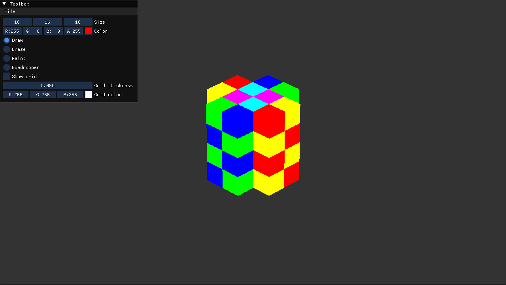

# Levox

A simple voxel editor made in C++ with SFML and OpenGL.




## Getting started

Download the latest build from the [Releases](https://github.com/hansielneff/Levox/releases) section or follow the instructions below to compile from source.

## Compiling from source

1. If you use Linux, install SFML's dependencies using your system package manager. On Ubuntu and other Debian-based distributions you can use the following commands:
    ```
    sudo apt update
    sudo apt install \
        libxrandr-dev \
        libxcursor-dev \
        libudev-dev \
        libfreetype-dev \
        libopenal-dev \
        libflac-dev \
        libvorbis-dev \
        libgl1-mesa-dev \
        libegl1-mesa-dev
    ```
1. Configure and build your project. Most popular IDEs support CMake projects with very little effort on your part.
    - [VS Code](https://code.visualstudio.com) via the [CMake extension](https://code.visualstudio.com/docs/cpp/cmake-linux)
    - [Visual Studio](https://docs.microsoft.com/en-us/cpp/build/cmake-projects-in-visual-studio?view=msvc-170)
    - [CLion](https://www.jetbrains.com/clion/features/cmake-support.html)
    - [Qt Creator](https://doc.qt.io/qtcreator/creator-project-cmake.html)

    Using CMake from the command line is straightforward as well.

    For a single-configuration generator (typically the case on Linux and macOS):
    ```
    cmake -S . -B build -DCMAKE_BUILD_TYPE=Release
    cmake --build build
    ```

    For a multi-configuration generator (typically the case on Windows):
    ```
    cmake -S . -B build
    cmake --build build --config Release
    ```
1. Enjoy!

## License

The source code is dual licensed under Public Domain and MIT -- choose whichever you prefer.
